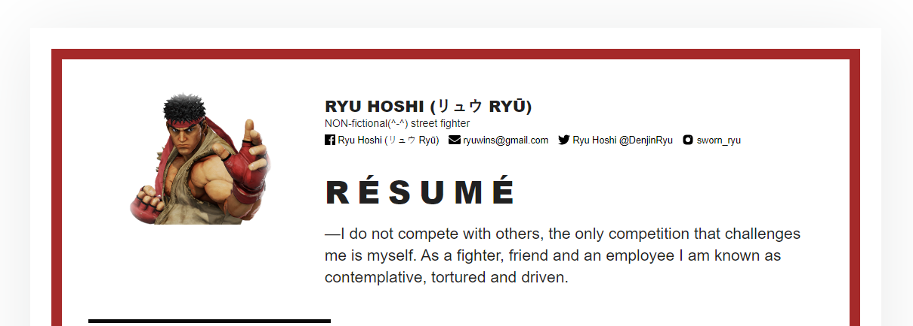

[](https://travis-ci.com/MoriArchi/homepage.svg?branch=develop)
# To live is to fight and to fight is to live
#### Hadouken! Pleased to meet you.

My name is Ryu Hoshi (リュウ Ryū) and this here is my website.

After defeating Sagat and M. Bison for the nth time, 
I’ve decided to downshift my martial arts career a little bit and get into this IT thing ― sensei tells me that there’s 
a lot of money on the Internet, and a whole lot less getting punched in the face. 
I created a little website to market my personal brand, then maybe i will sell a few t-shirts, nunchucks, that sort of thing ― 
I think it’ll be a big hit (TO THE SOLAR PLEXUS IYKWIM HAHAHA!.. woo, goddamn, I love hitting people...). 
Anyhow, here's what I wanted to create ― for starters just a quick intro page to let me know what I’m all about.  
Thanks for reading, man , I’m off to the Shaolin temple for a few weeks (teambuilding excersice, such b*llshit, ugh). 
And remember, winners never lose! ✌Peace!
------
Oops, forgot to talk about the technical part 😅

So, I've decided to host it with [**GitHub Pages**](https://pages.github.com/), because it's so much easier, cost efficient, 
and saves me time on deployments. Other than that it's just good old plain HTML and CSS with a very little bit of JavaScript. 
`<head>` is built using excellent [**HEAD**](https://github.com/joshbuchea/HEAD) for reference, `<body>` uses some of the styles from the great 
[**Semantic UI**](https://github.com/Semantic-Org/Semantic-UI) framework. Website is frequently tested with 
[**Lighthouse**](https://developers.google.com/web/tools/lighthouse/) automated tool. Amazing [**Workbox**](https://developers.google.com/web/tools/workbox/) 
helps build a decent Service Worker for this website _(hence it even works offline)_, [**serve**](https://zeit.co/blog/serve-7) 
is used to run my website locally during development. I have [**workbox**](https://github.com/GoogleChrome/workbox) and 
[**serve**](https://github.com/zeit/serve) npm packages installed globally with `sudo npm install --global workbox-cli serve`, 
and I've also set up a pre-commit git hook which automatically runs `workbox generateSW workbox-config.js` before I commit and push my code to GitHub, 
so that I don't have to do it manually every time I make changes. **.git/hooks/pre-commit** looks as simple as this:

``` bash
#!C:\cygwin64\bin\bash.exe
if workbox generateSW workbox-config.js ; then
  git add sw.js
  git add sw.js.map
  exit 0
else
  echo "Cannot generate sw.js"
  echo "Aborting"
fi
```

------
## Demo 
* [AWS](https://s3.console.aws.amazon.com/s3/buckets/moriarchi.github.io-production/?region=eu-west-3 "AWS")
* [Now](https://homepage-fjzmh1c3t.now.sh/ "Now")
* [GitHub Pages](https://moriarchi.github.io/homepage/ "GitHub Pages")
## Preview

